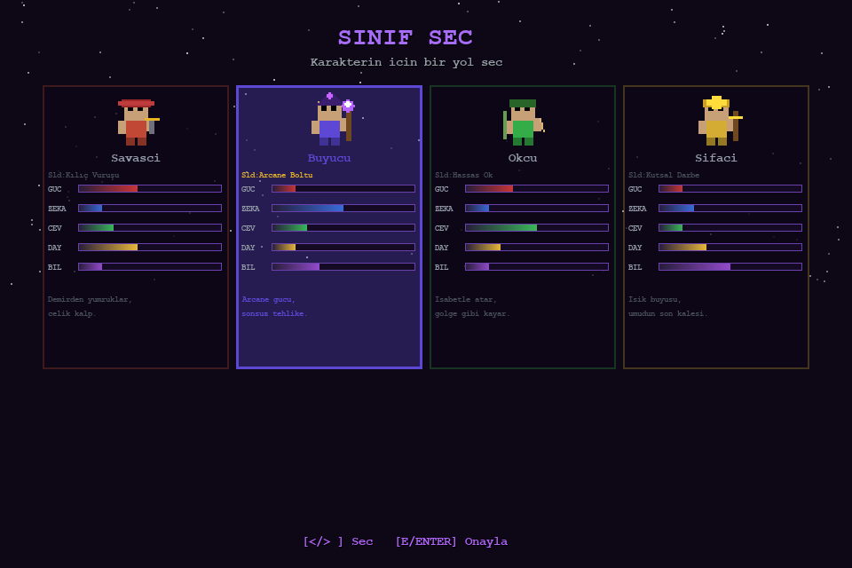
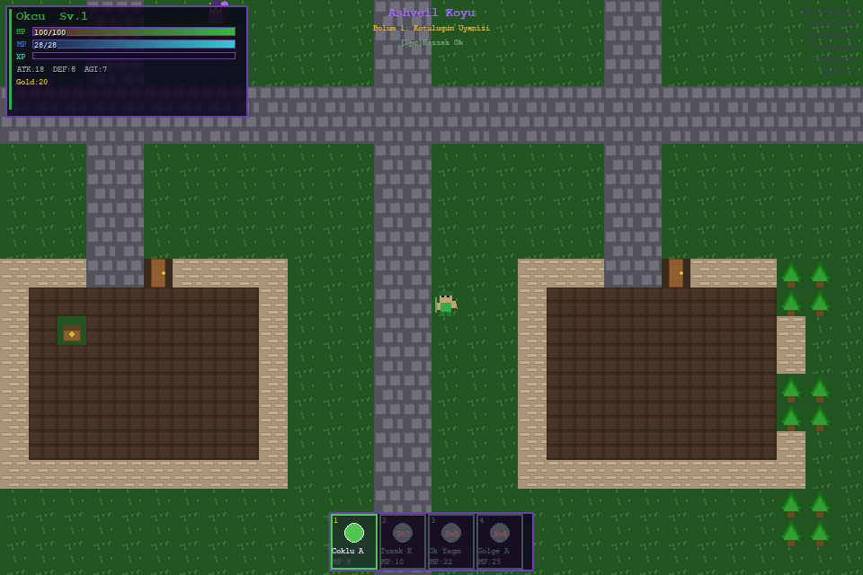
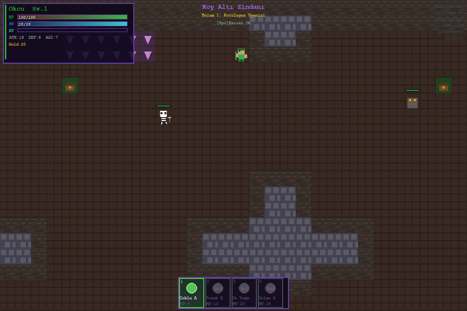
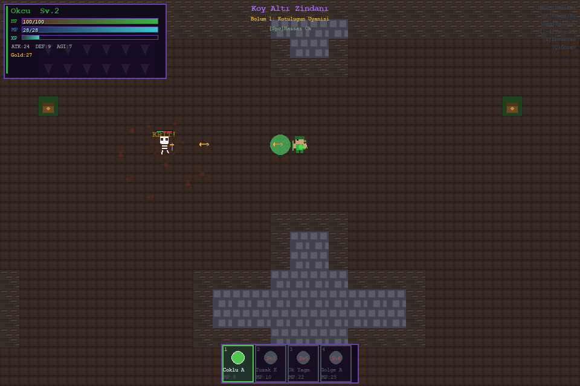
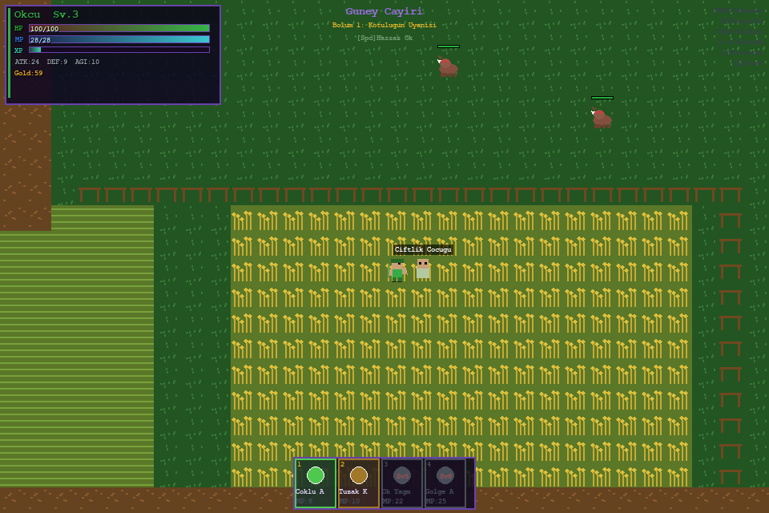

🎮 Dark Crown's Curse (Karanlık Tac'ın Laneti) — v5.0
=====================================================


**Dark Crown's Curse** is a retro-style 2D pixel art RPG built with Python and Pygame. It combines classic RPG exploration with modern procedural audio synthesis.

---

✨ Features
----------

* **Diverse Class System:** Choose between Warrior, Mage, Archer, or Healer.
* **Epic Questline:** 6 main chapters and various side quests (Scroll Hunt, Boar Hunt, etc.).
* **Procedural Audio:** All sound effects are generated via mathematical wave functions (numpy), requiring no external audio files.
* **Character Progression:** Attribute distribution (Stats), inventory management, and class-specific abilities.
* **Multilingual Support:** Toggle between Turkish and English in the settings menu.

---

📸 Screenshots
-------------







---

🕹️ Controls
-----------

| Key | Action |
| :--- | :--- |
| **WASD / Arrow Keys** | Movement |
| **E** | Talk / Interact / Confirm |
| **Space** | Class-Specific Attack |
| **1 / 2 / 3 / 4** | Use Skills |
| **I / Tab** | Inventory & Equipment (Switch Tabs) |
| **Q** | Quest Log |
| **U** | Attribute Distribution (Stats) |
| **F1 / F11** | Settings Menu / Toggle Fullscreen |
| **R** | Restart (Game Over screen) |
| **ESC** | Quit / Back |

---

⚔️ Character Classes
--------------------

* **Warrior:** Melee cone attack and shield abilities.
* **Mage:** Auto-aiming arcane bolts and meteor abilities.
* **Archer:** Precision arrow shots and multi-shot abilities.
* **Healer:** Holy strike, healing, and shield abilities.

---

🗺️ World & Main Quests
-----------------------

### Storyline (6 Chapters)
1. **Ashveil:** Speak with Elder Aldric.
2. **Dark Forest:** Find Sir Roland.
3. **Ancient Ruins:** Retrieve the Earth Crystal.
4. **Desert:** Find Oracle Nyx.
5. **Ice Cave:** Retrieve the Water Crystal.
6. **Shadow Castle:** Defeat Malachar!

---

🚀 Installation & Execution
---------------------------

### 1. Ready-to-Run (Executable)
* **Windows:** Double-click `build_windows.bat` and run `dist\game\KaranlikTacinLaneti.exe`.
* **macOS / Linux:** Run `chmod +x build_mac_linux.sh && ./build_mac_linux.sh`.

### 2. Run with Python
```bash
pip install pygame numpy
python pixel_rpg.py
```

---

📜 License & Acknowledgments
----------------------------

* **Source Code:** MIT License
* **Fonts:** Google Fonts — SIL Open Font License
* **Audio:** Procedural (no copyright issues)

---

⚠️ Important Notes
------------------

* **No External Assets:** The game runs without any external files (no .png, .wav, etc.).
* **Procedural Audio:** All sound effects are generated mathematically using numpy.
* **Settings:** Press F1 to adjust volume, language, and fullscreen settings.

<br>

<div align="center">
  <b>Made with ❤️ and Pygame</b>
</div>