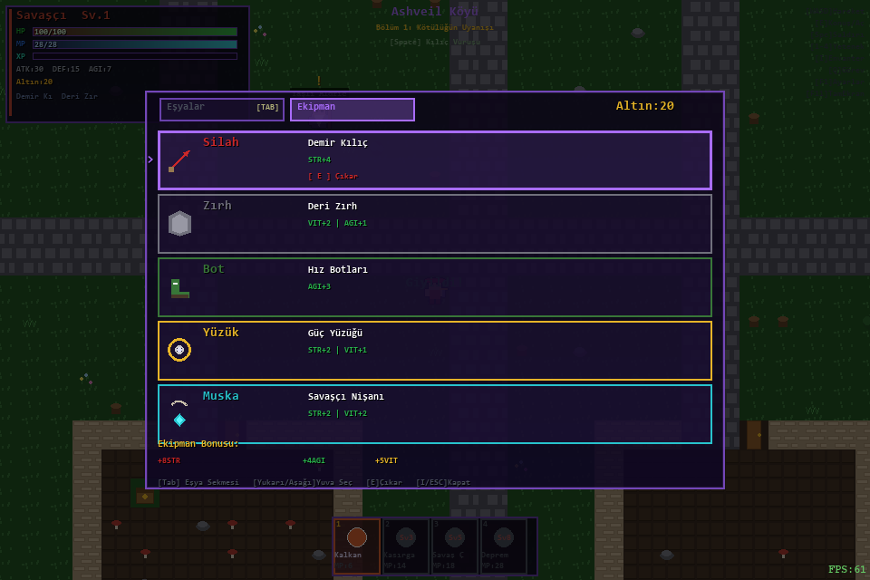
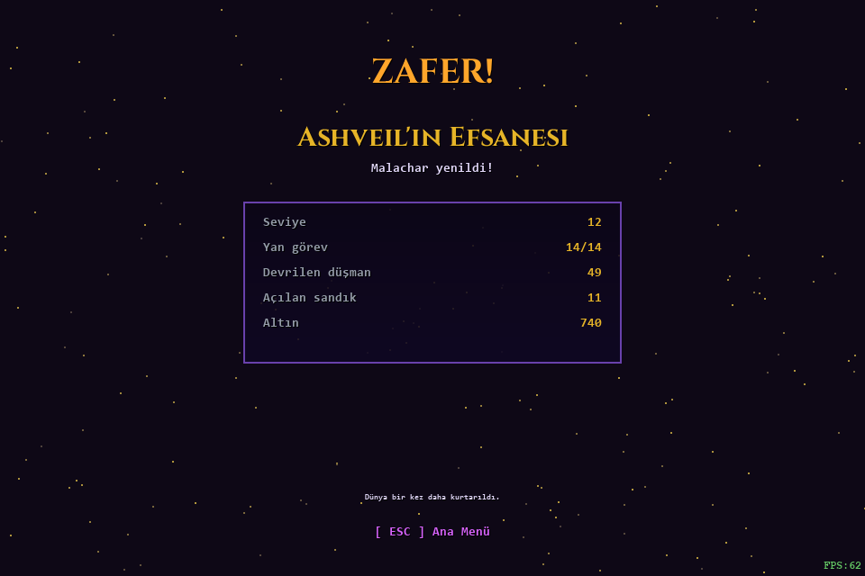

# Karanlık Taç'ın Laneti

**Tek dosyalık, bağımlılığı yalnız pygame olan 2D piksel RPG.**
Beş dilde oynanır, bütün grafikleri ve sesleri çalışma anında üretir — oyunun yanında tek bir `.png` ya da `.wav` yoktur.

> *Yüz yıl önce atalarımız Malachar'ı dört kristalle mühürledi. Mühür zayıflıyor.*


| | |
|---|---|
|  |  |
| Doğru element seçmek fark yaratır | Köz Vadisi — volkanik yan bölge |
|  |  |
| Beş ekipman yuvası | Yaptıklarına göre değişen kapanış |

---

## Kurulum

### Seçenek 1 — Hazır sürümü indir (önerilen)

[**Releases**](https://github.com/Lagarux/pixel-rpg/releases) sayfasından `KaranlikTacinLaneti-v6.0-Windows.zip` dosyasını indirin, açın, `KaranlikTacinLaneti.exe` dosyasını çalıştırın. Python kurmanıza gerek yok.

### Seçenek 2 — Kaynaktan çalıştır

```bash
git clone https://github.com/Lagarux/pixel-rpg.git
cd pixel-rpg
pip install pygame
python pixel_rpg.py
```

Python 3.8 veya üstü yeterli. **Tek bağımlılık pygame'dir** — numpy, ses dosyası, görsel dosyası gerekmez.

### Kendiniz derlemek isterseniz

```bash
pip install pygame pyinstaller
python make_icon.py                       # ikonu üret
pyinstaller --clean KaranlikTacinLaneti.spec
```

Windows'ta `build_release.bat`, Linux'ta `build_linux_release.sh` bütün adımları tek seferde yapar ve `release/` klasörüne ZIP çıkarır.

---

## Kontroller

Oyuna ilk girişte klavye tanıtımı bir kez açılır; sonra duraklatma menüsünden (`ESC` → Kontroller) tekrar açılabilir.

| Tuş | İşlev |
|---|---|
| `WASD` / Ok tuşları | Hareket |
| `Space` | Sınıfa özel saldırı |
| `1` `2` `3` `4` | Yetenekler |
| `E` | Konuş / Al / Dükkân |
| `I` | Envanter ve Ekipman (`TAB` ile sekme değiştir) |
| `Q` | Görev günlüğü |
| `M` | Mini harita aç/kapat |
| `U` | Nitelik dağıtımı |
| `F1` | Ayarlar · `F11` Tam ekran · `ESC` Duraklat |

---

## Oyunda neler var

| | |
|---|---|
| **13 harita** | Köy, orman, harabeler, kayalık geçit, bataklık, çöl, buz mağarası, Köz Vadisi, gölge kalesi, çayır, nehir, kütüphane, zindan |
| **4 sınıf** | Savaşçı, Büyücü, Okçu, Şifacı — 16 yetenek |
| **7 element** | Fiziksel, ateş, buz, doğa, gölge, kutsal, toprak. Her düşmanın ve her saldırının bir elementi var |
| **6 ana bölüm + 14 yan görev** | Ödüller altın ve XP; ilerleme sağ panelde takip edilir |
| **24 NPC** | Oyunun gidişatına ve senin yaptıklarına göre konuşurlar |
| **6 dükkân** | Demirci, han ve dört tezgâhlı pazar meydanı; alış/satış/konaklama |
| **90 düşman, 10 tür** | Dört davranış: yanaşan, menzilli, kaçan, sürü hâlinde avlanan |
| **Kapanış** | Bitirdiğin yan görevler epiloğa kendi sahnesini ekler; sonda unvan ve yolculuk özeti |

### Element tablosu

| Saldırı | Güçlü | Zayıf |
|---|---|---|
| Ateş | Doğa, Buz | Ateş, Toprak |
| Buz | Doğa, Toprak | Ateş, Buz |
| Doğa | Toprak, Gölge | Doğa, Ateş |
| Gölge | Kutsal, Doğa, Fiziksel | Gölge |
| Kutsal | Gölge, Fiziksel | Kutsal |
| Toprak | Ateş, Fiziksel | Doğa, Toprak |
| Fiziksel | — (nötr) | — |

Fiziksel bilerek nötr bırakıldı: herkesin elindeki temel saldırı cezalandırılırsa savaşçı ve okçu gölge düşmanlara karşı çaresiz kalır. Silahın elementi temel saldırıya geçer; zırh ve muskalar bir elemente karşı koruma verir.

---

## Diller

Türkçe, İngilizce, Almanca, Rusça, Arapça. `F1` → Dil ile değiştirilir, tercih kaydedilir.

Çeviriler `assets/locales/*.json` dosyalarında (591 anahtar). Bunlar elle düzenlenmez — tek kaynak `tools/locales_data.py`'dir:

```bash
python tools/locales_data.py     # bes JSON dosyasini yeniden uretir
```

Yazı tipi dile göre seçilir: oyun her yazı tipini gerçekten deneyip gerekli karakterleri çizebildiğini doğrular, çizemiyorsa bir sonrakine geçer. Arapça için kelime sırası sağdan sola çevrilir (`python-bidi` kuruluysa onu kullanır).

---

## Geliştirme

### Testler

```bash
python -m unittest discover -s tests
```

**247 test**, 19 dosya. Pencere açmadan gerçek kare çizerek çalışırlar (`SDL_VIDEODRIVER=dummy`), ek bağımlılık istemezler — `unittest` yeterlidir.

Testler yalnızca "çağrı patlamadı" demiyor, davranışı ölçüyor:

| Dosya | Ne koruyor |
|---|---|
| `test_world.py` | Harita geçişleri, oyuncunun iki harita arasında sıkışmaması, kenarların kapalı olması |
| `test_quests.py` | Her yan görevin gerçekten bitirilebilmesi — hedef düşmanların oyuncunun gidebildiği haritalarda olması |
| `test_elements.py` | Denge: hiçbir düşmanın 3 vuruştan çabuk ölmemesi, hiçbir sınıfın bir türe karşı çaresiz kalmaması |
| `test_sound.py` | Seslerin üretilmesi, dolu olması ve sert olmaması (ölçülen parlaklık değeriyle) |
| `test_dialogue.py` | Her NPC'nin yeterince konuşması, beş dilde çevrili olması, satırların kutuya sığması |
| `test_source_sanity.py` | Modülde tanımsız isim kalmaması (`symtable` taraması) |
| `test_save_load.py` | Kaydet–yükle turunun her şeyi geri getirmesi |

Geliştirme süreci ve her kararın gerekçesi [`GELISTIRME_PLANI.md`](GELISTIRME_PLANI.md) dosyasında kayıtlı.

### Dizin yapısı

```
pixel_rpg.py            oyunun tamami (~5000 satir)
assets/locales/*.json   bes dil (tools/locales_data.py uretir)
assets/fonts/           ortacag yazi tipleri
tests/                  247 test + kosum takimi (harness.py)
tools/                  ceviri ureteci, sprite tablosu
docs/                   README gorselleri
```

### Nasıl çalışıyor

Bütün grafikler `pygame.draw` ile çalışma anında çiziliyor, bütün sesler saf Python'la sentezleniyor (stdlib `array` → `mixer.Sound`). Oyunun yanında hiçbir medya dosyası yok; `assets/` içinde yalnızca yazı tipleri, çeviriler ve ikon var.

Kayıtlar ve ayarlar `%APPDATA%\KaranlikTacinLaneti\` (Windows) ya da `~/.local/share/KaranlikTacinLaneti/` altına yazılır — oyunun kurulu olduğu klasöre değil.

---

<details>
<summary><b>English</b></summary>

## The Dark Crown's Curse

A single-file 2D pixel RPG whose only dependency is pygame. Every graphic is drawn and every sound is synthesised at runtime — the game ships with no `.png` and no `.wav`.

### Install

Download `KaranlikTacinLaneti-v6.0-Windows.zip` from [Releases](https://github.com/Lagarux/pixel-rpg/releases) and run the executable, or run from source:

```bash
pip install pygame
python pixel_rpg.py
```

Python 3.8+. pygame is the only requirement.

### Controls

`WASD`/arrows move · `Space` attack · `1-4` abilities · `E` interact · `I` inventory · `Q` quests · `M` minimap · `U` stats · `F1` settings · `F11` fullscreen · `ESC` pause. A one-time keyboard tutorial opens on first launch.

### What's in it

13 maps, 4 classes with 16 abilities, 7 elements, 6 story chapters, 14 side quests, 24 NPCs, 6 shops including a four-stall bazaar, 90 enemies across 10 kinds with four behaviours (melee, ranged, skittish, pack), and an epilogue that changes with what you completed.

Five languages: Turkish, English, German, Russian, Arabic. Switch with `F1`. Translations live in `assets/locales/*.json`, generated from `tools/locales_data.py`.

### Tests

```bash
python -m unittest discover -s tests
```

247 tests across 19 files, using only `unittest`. They render real frames headlessly (`SDL_VIDEODRIVER=dummy`) and measure behaviour rather than just checking that calls succeed: that no side quest is impossible to finish, that no enemy dies in two hits, that the player can never get stuck between two maps, that every dialogue line fits the box in all five languages.

</details>

---

## Lisans

Bu depo Lagarux tarafından geliştirilmektedir. Yazı tipleri kendi lisanslarıyla gelir (`assets/fonts/`).
