# Karanlık Taç'ın Laneti

**Tek dosyalık, bağımlılığı yalnız pygame olan 2D piksel RPG.**
Beş dilde oynanır, bütün grafikleri ve sesleri çalışma anında üretir — oyunun yanında tek bir `.png` ya da `.wav` yoktur.

> *Yüz yıl önce atalarımız Malachar'ı dört kristalle mühürledi. Mühür zayıflıyor.*

<p align="center">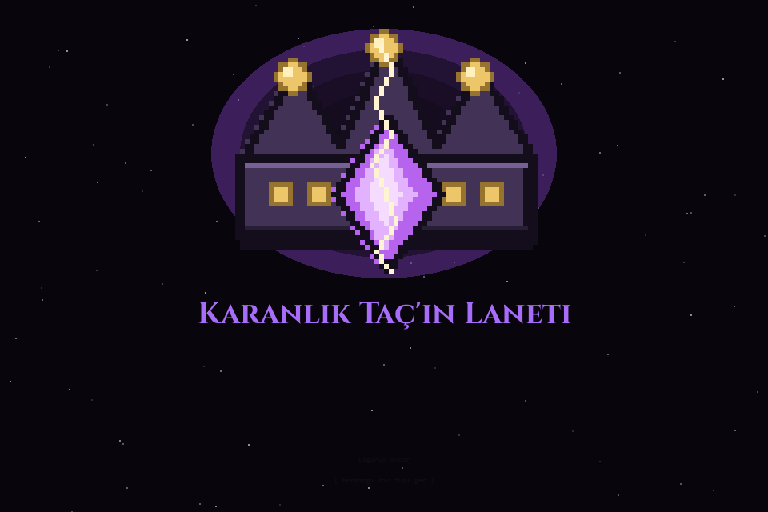</p>

| | |
|---|---|
| 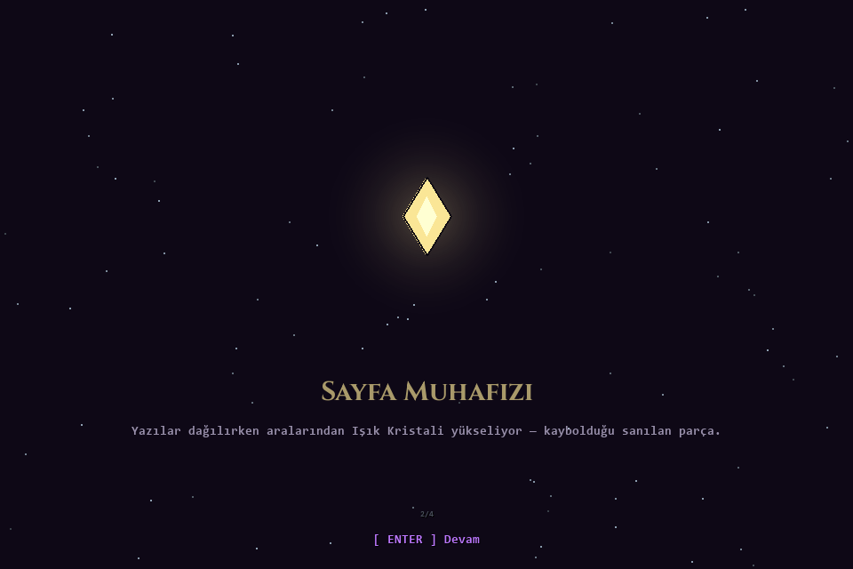 | 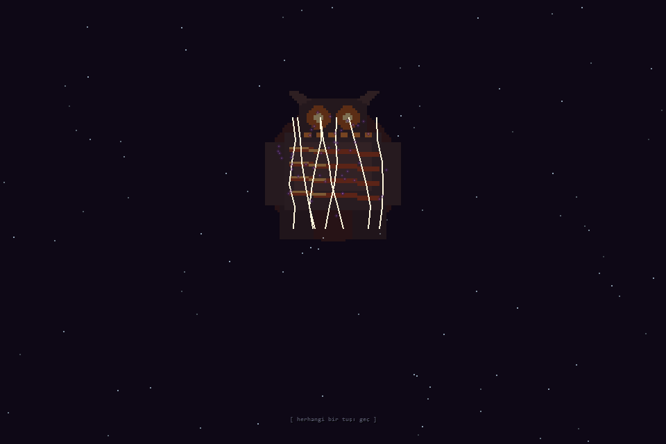 |
| Her ana boss düştüğünde mühürden bir parça geri alınır | Silüet çatlar, karanlık zerrelere dağılır |
| 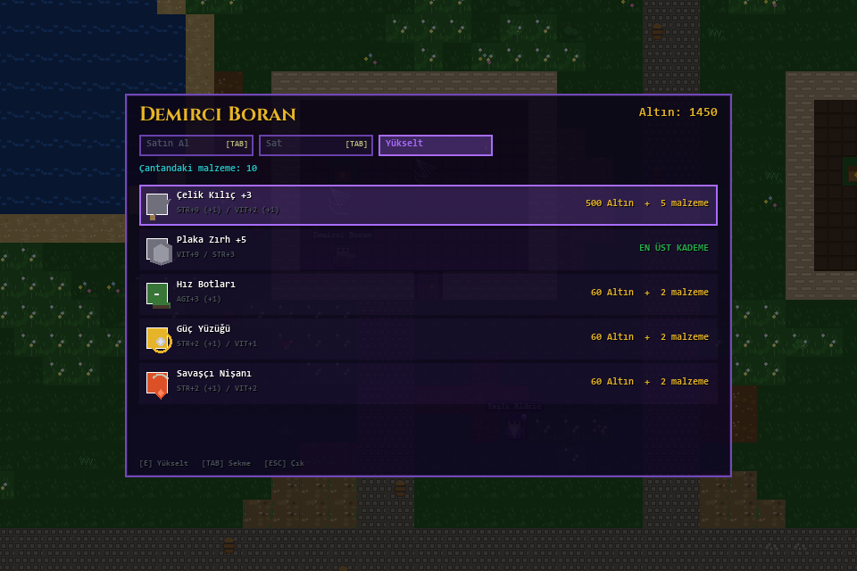 | 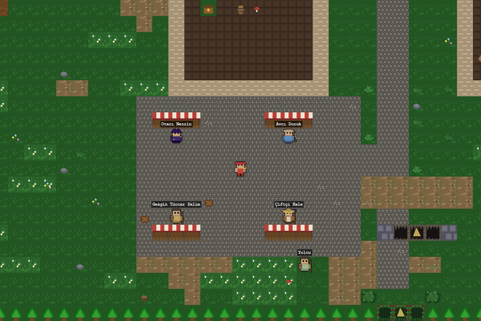 |
| Demirci ekipmanı +5'e kadar yükseltir | Dört tezgâhlı pazar meydanı |
| 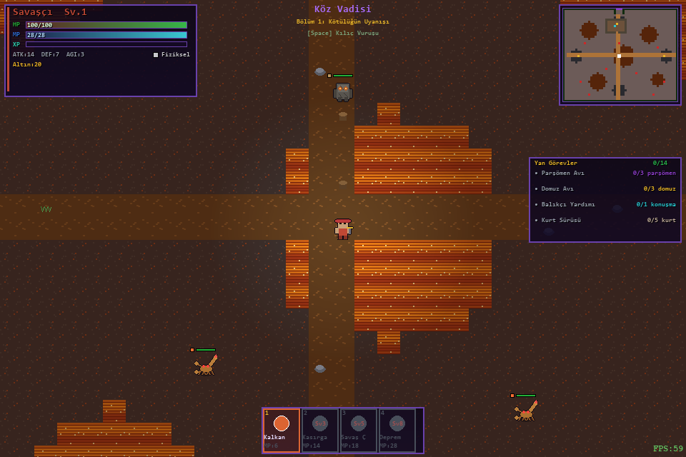 | 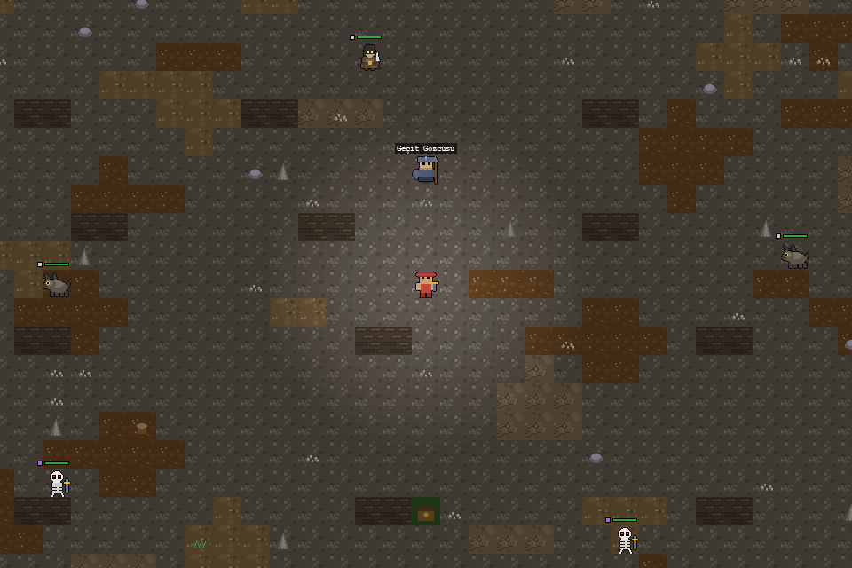 |
| Köz Vadisi — volkanik yan bölge | Kayalık Geçit — çakıl, çam ve dağ yolu |
| 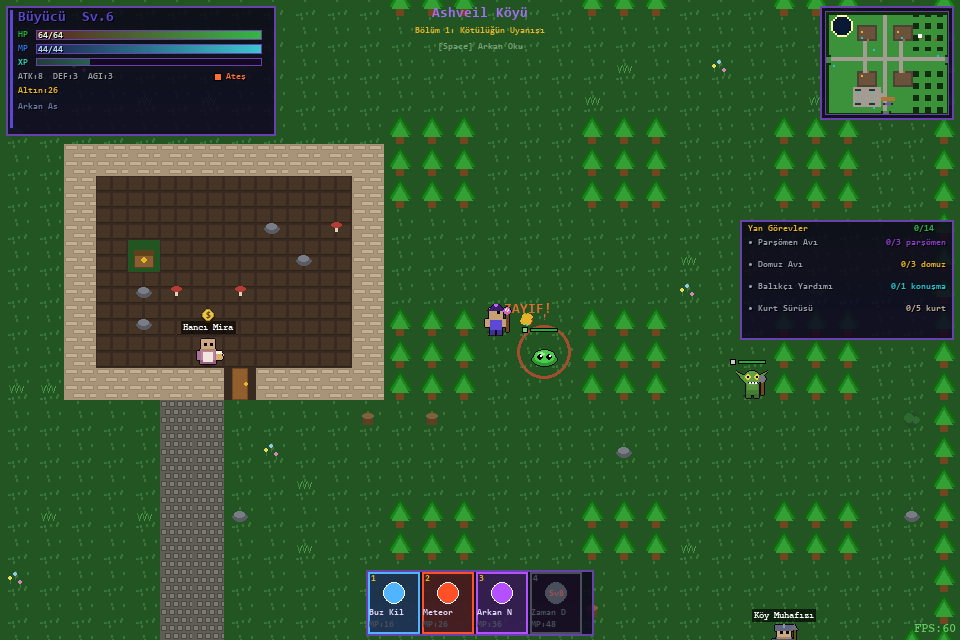 | 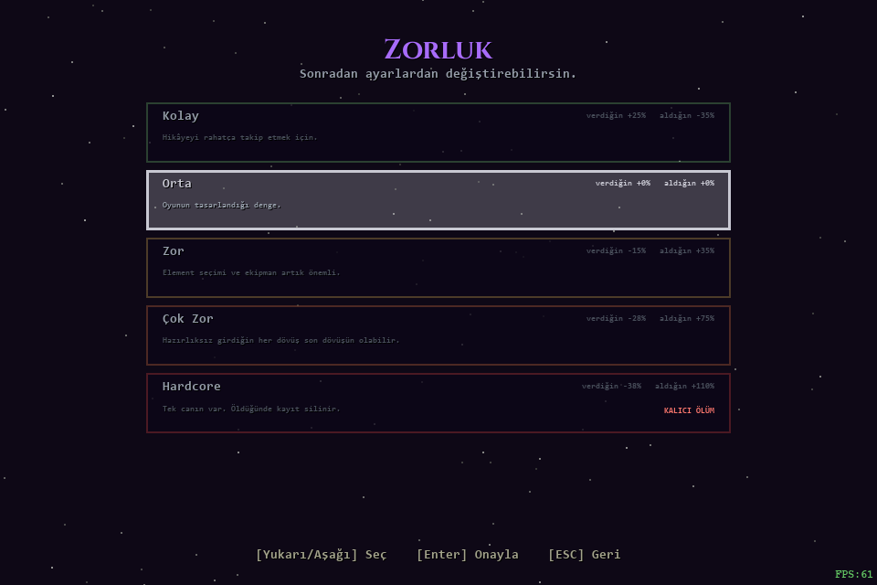 |
| Doğru element seçmek fark yaratır | Beş zorluk seviyesi |

---

## Kurulum

### Seçenek 1 — Hazır sürümü indir (önerilen)

[**Releases**](https://github.com/Lagarux/pixel-rpg/releases) sayfasından `KaranlikTacinLaneti-v6.3-Windows.zip` dosyasını indirin, açın, `KaranlikTacinLaneti.exe` dosyasını çalıştırın. Python kurmanıza gerek yok.

### Seçenek 2 — Kaynaktan çalıştır

```bash
git clone https://github.com/Lagarux/pixel-rpg.git
cd pixel-rpg
pip install pygame
python pixel_rpg.py
```

Python 3.8 veya üstü yeterli. **Tek bağımlılık pygame'dir** — numpy, ses dosyası, görsel dosyası gerekmez.

### Kendiniz derlemek isterseniz

```bash
pip install pygame pyinstaller
python make_icon.py                       # ikonu üret
pyinstaller --clean KaranlikTacinLaneti.spec
```

Windows'ta `build_release.bat`, Linux'ta `build_linux_release.sh` bütün adımları tek seferde yapar ve `release/` klasörüne ZIP çıkarır. İkisi de sürümü `pixel_rpg.py`'den okur; elle yazılmaz.

---

## Kontroller

Oyuna ilk girişte klavye tanıtımı bir kez açılır; sonra duraklatma menüsünden (`ESC` → Kontroller) tekrar açılabilir.

| Tuş | İşlev |
|---|---|
| `WASD` / Ok tuşları | Hareket |
| `Space` | Sınıfa özel saldırı |
| `1` `2` `3` `4` | Yetenekler |
| `E` | Konuş / Al / Dükkân |
| `I` | Envanter ve Ekipman (`TAB` ile sekme değiştir) |
| `Q` | Görev günlüğü |
| `M` | Mini harita aç/kapat |
| `U` | Nitelik dağıtımı |
| `F1` | Ayarlar · `F11` Tam ekran · `ESC` Duraklat |

Dükkânda `TAB` sekmeleri dolaşır: **Satın Al · Sat · Yükselt** (yükseltme yalnızca demircide).

---

## Oyunda neler var

| | |
|---|---|
| **13 harita** | Köy, orman, harabeler, kayalık geçit, bataklık, çöl, buz mağarası, Köz Vadisi, gölge kalesi, çayır, nehir, kütüphane, zindan |
| **4 sınıf** | Savaşçı, Büyücü, Okçu, Şifacı — 16 yetenek |
| **7 element** | Fiziksel, ateş, buz, doğa, gölge, kutsal, toprak. Her düşmanın ve her saldırının bir elementi var |
| **6 ana bölüm + 22 yan görev** | Ödüller altın ve XP; günlük `Q` ile açılır, `W`/`S` ile kaydırılır |
| **24 NPC** | Oyunun gidişatına ve senin yaptıklarına göre konuşurlar |
| **6 dükkân** | Demirci, han ve dört tezgâhlı pazar meydanı; alış/satış/konaklama/yükseltme |
| **131 düşman, 18 tür** | Beş davranış: yanaşan, menzilli, kaçan, sürü hâlinde avlanan, ağ atan |
| **5 ana boss** | Dördü birer kristal muhafızı, beşincisi Malachar. Her biri düştüğünde araya sahne girer |
| **39 ekipman + 36 eşya** | Beş yuva, üç kademe, 15 malzeme, iksirler ve tonikler |
| **5 zorluk** | Kolay · Orta · Zor · Çok Zor · **Hardcore** (tek can — ölünce kayıt silinir) |
| **Kapanış** | Bitirdiğin yan görevler ve topladığın kristaller epiloğa kendi sahnesini ekler |

### Element tablosu

| Saldırı | Güçlü | Zayıf |
|---|---|---|
| Ateş | Doğa, Buz | Ateş, Toprak |
| Buz | Doğa, Toprak | Ateş, Buz |
| Doğa | Toprak, Gölge | Doğa, Ateş |
| Gölge | Kutsal, Doğa, Fiziksel | Gölge |
| Kutsal | Gölge, Fiziksel | Kutsal |
| Toprak | Ateş, Fiziksel | Doğa, Toprak |
| Fiziksel | — (nötr) | — |

Fiziksel bilerek nötr bırakıldı: herkesin elindeki temel saldırı cezalandırılırsa savaşçı ve okçu gölge düşmanlara karşı çaresiz kalır. Silahın elementi temel saldırıya geçer; zırh ve muskalar bir elemente karşı koruma verir.

---

## Avlanma, malzeme ve yükseltme

Oyunun ekonomisi ölçülerek yeniden kuruldu. Önceki hâlinde toplanabilecek **toplam altın 1730**'du ve mağazadaki 22 eşyanın **19'u sandıklardan bedava** çıkıyordu — en pahalı iki silah dahil. Altının harcanacak yeri yoktu; 90 düşmanın her biri bir kez öldüğü için de oyun seviye 10'da bitiyordu.

| | |
|---|---|
| **Geri doğum** | Boss dışındaki düşmanlar 60 saniye sonra kendi karelerinde geri doğar. Oyuncu 14 kareden yakınsa bekler: gözünün önünde belirmez |
| **Malzemeler** | Her türün kendi malzemesi var (15 adet, 8–44 altın). %45 ihtimalle düşer; avlanmanın asıl geliri budur |
| **Yükseltme** | Demirci giyili her parçayı **+5**'e kadar yükseltir. Altın + malzeme harcar; en güçlü niteliği her kademede +1, ikincisini iki kademede +1 alır |
| **Üst kademe** | 690–860 altınlık parçalar hiçbir sandıktan çıkmaz, yalnızca satın alınır |
| **Seviye** | Tavan 30. Eğri ilk yedi seviyede eskisi gibi hızlı, sonrasında yumuşuyor |

Sayılarla: sandıktan çıkan en pahalı ekipman 280 → **195 altın**; yalnızca satın alınabilen ekipman 3 → **23 parça**; bir temizlikte toplanan altın 1730 → **3083**; harcanacak hedef (üst kademe takım + yükseltmeler) **12.470 altın + 100 malzeme**.

### Zorluk eğrisi

Haritaların sertliği elle yazılmıştı ve başlangıca uzaklığıyla ilgisi yoktu: **iki adım** ötedeki Gizemli Kütüphane (91 can / 15,1 saldırı), **dört adım** ötedeki Buz Mağarası'ndan (77 / 12,6) sertti. Artık her haritanın bir kademesi var — geçiş grafiğindeki adım sayısı — ve değerler o kademeye ölçekleniyor. Harita *içindeki* oranlar korunuyor: golem balçıktan sert kalıyor.

| Adım | Ortalama can | Ortalama saldırı | Boss |
|---|---|---|---|
| 0 — Ashveil | 36 | 6 | — |
| 1 — orman, çayır, nehir, zindan | 56 | 10 | — |
| 2 — harabeler, bataklık, geçit, kütüphane | 74 | 13 | 192 / 18 |
| 3 — çöl | 92 | 16 | — |
| 4 — buz mağarası, Köz Vadisi | 110 | 20 | 286 / 27 |
| 5 — gölge kalesi | 132 | 25 | 620 / 38 |

Kademe tablosunun geçiş grafiğiyle uyuştuğu testle sınanıyor: yeni bir harita eklenip kademesi unutulamaz.

---

## Boss sahneleri

Malachar dışındaki boss'lar sessizce ölüyordu. Artık her ana boss düştüğünde araya bir sahne giriyor: silüet titrer, üzerinde çatlaklar koşar, dağılıp karanlık zerrelere dönüşür, yerinde bir kristal belirir ve ne olduğu sayfa sayfa anlatılır. 2,6 saniye sürer, herhangi bir tuşla geçilir.

Hikâyede **dört kristalden** söz ediliyordu ama oyunda ikisi vardı. Köz Vadisi'ne **Köz Devi**, Gizemli Kütüphane'ye **Sayfa Muhafızı** kondu; ikisi de isteğe bağlı, ana zinciri kilitlemiyor, ama kapanışa kendi sayfasını ekliyor ve unvanı yükseltiyor.

---

## Haritalar ve karolar

| | |
|---|---|
| 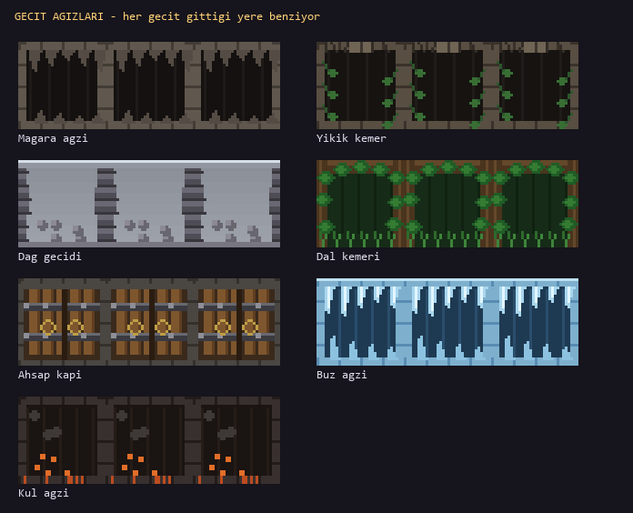 | 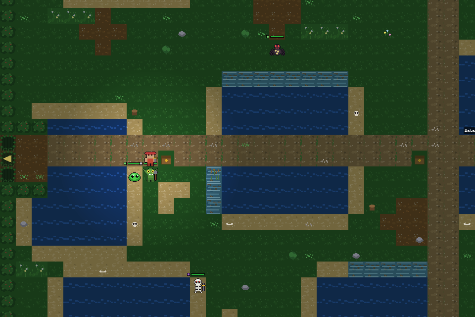 |
| Yedi geçit ağzı üslubu | Sisli Bataklık — sığ su, saz, nilüfer |

<p align="center">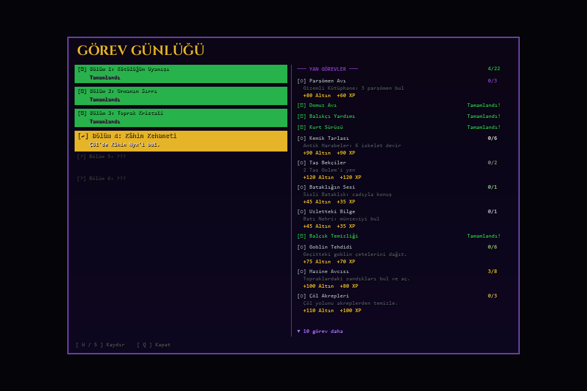<br><i>Yirmi iki yan görev — günlük W/S ile kaydırılır</i></p>

Geçitlerin hepsi aynı taş çerçeveydi: ormanın kenarında da, buz mağarasının ağzında da, kalenin kapısında da. Artık **her geçit gittiği yere benziyor** — mağara ağzı, yıkık kemer, dağ geçidi, dal kemeri, ahşap kapı, buz ağzı, kül ağzı.

Dokuz yeni zemin karosu eklendi (patika, yeşillik, çalı çit, yosunlu taş, döküntü, çakıl, çam, sığ su, çatlak zemin). Ölçüm: baskın zemin oranı harabelerde %100 → %66, kayalık geçitte %99 → %65; en büyük tek tip blok 16 kare → 12; harita başına zemin türü 2–3 → 4–9. Köz Vadisi'nin dekor yoğunluğu %0,7 → %6,1 (kül ve buz karolarının dekor kaydı eksikti).

Dünya artık halka: Ashveil → Çayır → Bataklık → Orman → Ashveil. Eskiden bataklığın Ashveil'e tek yönlü bir kısa yolu vardı ve dönüşü yoktu.

---

## İki logo

Oyunun iki ayrı logosu var ve ikisi de aynı tasarımı paylaşıyor:

| | |
|---|---|
| **Oyun içi amblem** | `PA.logo()` ile çalışma anında çiziliyor. Açılış animasyonunda yükselip çatlıyor, başlık ekranında duruyor |
| **Uygulama ikonu** | `assets/icon.ico` — masaüstü ve görev çubuğu. 16'dan 256 piksele altı boyut; 32 ve altında okunabilirlik için sadeleştirilmiş çizim kullanılıyor |

İkon oyunun kendi çiziminden üretiliyor, elle çizilmiş bir dosya değil:

```bash
python tools/make_logo_icon.py
```

Önceki ikon `assets/icon_onceki.ico` olarak saklandı.

## Diller

Türkçe, İngilizce, Almanca, Rusça, Arapça. `F1` → Dil ile değiştirilir, tercih kaydedilir.

Çeviriler `assets/locales/*.json` dosyalarında (787 anahtar). Bunlar elle düzenlenmez — tek kaynak `tools/locales_data.py`'dir:

```bash
python tools/locales_data.py     # bes JSON dosyasini yeniden uretir
```

Yazı tipi dile göre seçilir: oyun her yazı tipini gerçekten deneyip gerekli karakterleri çizebildiğini doğrular, çizemiyorsa bir sonrakine geçer. Arapça için kelime sırası sağdan sola çevrilir (`python-bidi` kuruluysa onu kullanır).

---

## Geliştirme

### Testler

```bash
python -m unittest discover -s tests
```

**398 test**, 24 dosya. Pencere açmadan gerçek kare çizerek çalışırlar (`SDL_VIDEODRIVER=dummy`), ek bağımlılık istemezler — `unittest` yeterlidir.

Testler yalnızca "çağrı patlamadı" demiyor, davranışı ölçüyor:

| Dosya | Ne koruyor |
|---|---|
| `test_world.py` | Harita geçişleri, oyuncunun iki harita arasında sıkışmaması, kenarların kapalı olması |
| `test_tiles.py` | Hiçbir haritanın tek karoyla kaplanmaması, her geçidin üslubunun olması, ulaşılamayan adacık kalmaması, her geçişin dönüşünün olması |
| `test_economy.py` | Sandıktan üst kademe çıkmaması, her türün malzemesi olması, geri doğumun çalışması, seviye tavanının ulaşılabilir olması |
| `test_boss.py` | Her boss'un sahnesinin açılması, kristallerin kapanışa işlemesi, anlatının kutuya sığması |
| `test_curve.py` | Zorluğun haritanın uzaklığıyla artması, kademe tablosunun geçiş grafiğiyle uyuşması, boss adının çevrili olması |
| `test_quests.py` | Her yan görevin gerçekten bitirilebilmesi — hedef düşmanların oyuncunun gidebildiği haritalarda olması |
| `test_elements.py` | Denge: hiçbir düşmanın 3 vuruştan çabuk ölmemesi, hiçbir sınıfın bir türe karşı çaresiz kalmaması |
| `test_sound.py` | Seslerin üretilmesi, dolu olması ve sert olmaması (ölçülen parlaklık değeriyle) |
| `test_dialogue.py` | Her NPC'nin yeterince konuşması, beş dilde çevrili olması, satırların kutuya sığması |
| `test_source_sanity.py` | Modülde tanımsız isim kalmaması (`symtable` taraması) |
| `test_save_load.py` | Kaydet–yükle turunun her şeyi geri getirmesi |

Geliştirme süreci ve her kararın gerekçesi [`GELISTIRME_PLANI.md`](GELISTIRME_PLANI.md) dosyasında kayıtlı.

### Dizin yapısı

```
pixel_rpg.py            oyunun tamami (~6900 satir)
assets/locales/*.json   bes dil (tools/locales_data.py uretir)
assets/fonts/           ortacag yazi tipleri
tests/                  398 test + kosum takimi (harness.py)
tools/                  ceviri ureteci, ikon ureteci
docs/                   README gorselleri
```

### Nasıl çalışıyor

Bütün grafikler `pygame.draw` ile çalışma anında çiziliyor, bütün sesler saf Python'la sentezleniyor (stdlib `array` → `mixer.Sound`). Oyunun yanında hiçbir medya dosyası yok; `assets/` içinde yalnızca yazı tipleri, çeviriler ve ikon var.

Kayıtlar ve ayarlar `%APPDATA%\KaranlikTacinLaneti\` (Windows) ya da `~/.local/share/KaranlikTacinLaneti/` altına yazılır — oyunun kurulu olduğu klasöre değil.

---

<details>
<summary><b>English</b></summary>

## The Dark Crown's Curse

A single-file 2D pixel RPG whose only dependency is pygame. Every graphic is drawn and every sound is synthesised at runtime — the game ships with no `.png` and no `.wav`.

### Install

Download `KaranlikTacinLaneti-v6.3-Windows.zip` from [Releases](https://github.com/Lagarux/pixel-rpg/releases) and run the executable, or run from source:

```bash
pip install pygame
python pixel_rpg.py
```

Python 3.8+. pygame is the only requirement.

### Controls

`WASD`/arrows move · `Space` attack · `1-4` abilities · `E` interact · `I` inventory · `Q` quests · `M` minimap · `U` stats · `F1` settings · `F11` fullscreen · `ESC` pause. In shops `TAB` cycles Buy · Sell · Upgrade. A one-time keyboard tutorial opens on first launch.

### What's in it

13 maps, 4 classes with 16 abilities, 7 elements, 6 story chapters, 22 side quests, 24 NPCs, 6 shops including a four-stall bazaar, 131 enemies across 18 kinds with five behaviours, 39 equipment pieces across three tiers, 15 crafting materials, and an epilogue that changes with what you completed.

**Difficulty curve.** Every map has a tier equal to its distance in map-hops from the start, and enemy values are scaled to that tier. Previously the Mystic Library, two hops from the village, was harder than the Ice Cave four hops away. A test checks the tier table against the actual transition graph.

**Hunting loop.** Non-boss enemies respawn after 60 seconds at their own tile (and wait while you are within 14 tiles). Each kind drops its own material, which you sell or spend at the blacksmith to upgrade equipment up to +5. Top-tier gear is purchase-only. The level cap is 30.

**Boss scenes.** Every main boss now gets a cutscene: the silhouette cracks, scatters into dark motes, and leaves a crystal behind while the story explains what was reclaimed. The lore spoke of four crystals but the game only had two; the Ember Titan and the Page Warden were added for the other two.

Five languages: Turkish, English, German, Russian, Arabic. Switch with `F1`. Translations live in `assets/locales/*.json`, generated from `tools/locales_data.py`.

### Tests

```bash
python -m unittest discover -s tests
```

398 tests across 24 files, using only `unittest`. They render real frames headlessly (`SDL_VIDEODRIVER=dummy`) and measure behaviour rather than just checking that calls succeed: that no side quest is impossible to finish, that no enemy dies in two hits, that the player can never get stuck between two maps, that no map is covered by a single tile type, that nothing above 210 gold comes free from a chest, and that every dialogue line fits the box in all five languages.

</details>

---

## Lisans

Bu depo Lagarux tarafından geliştirilmektedir. Yazı tipleri kendi lisanslarıyla gelir (`assets/fonts/`).
